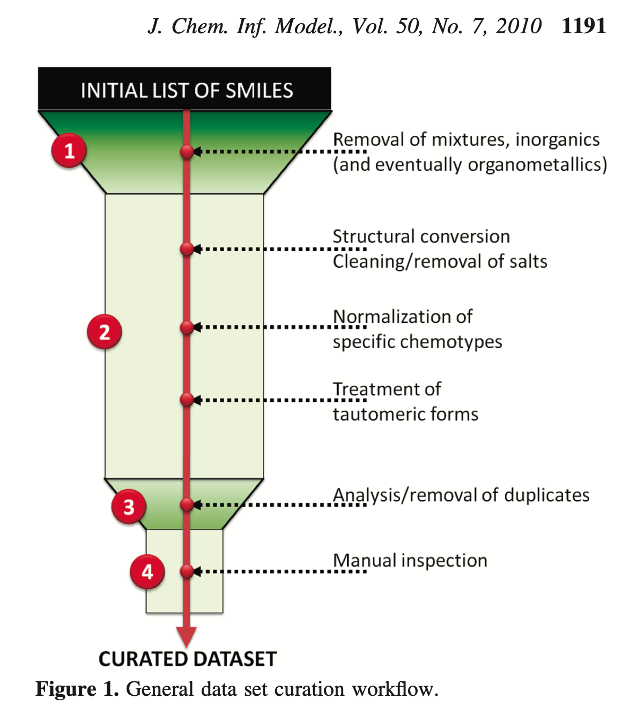
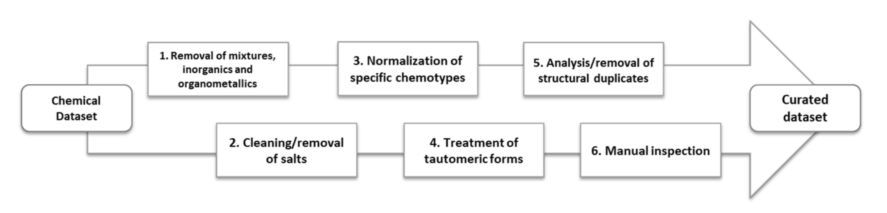
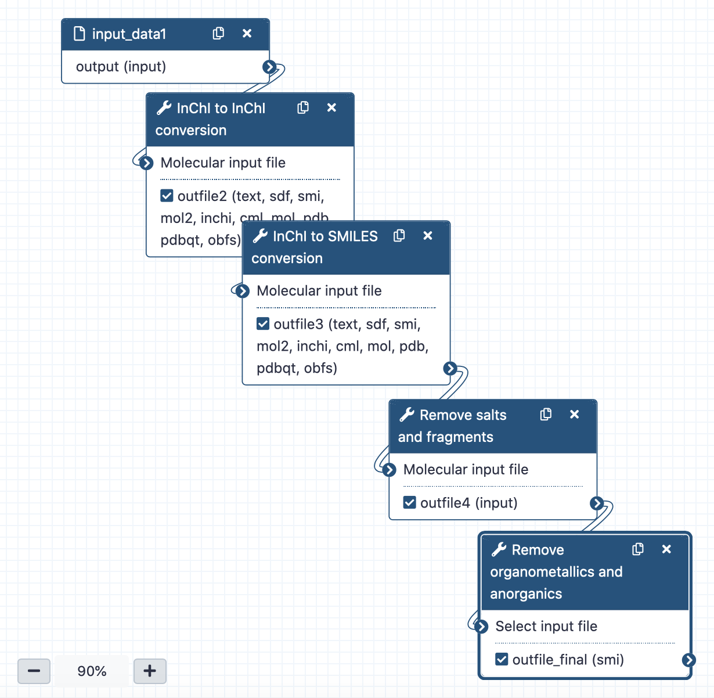
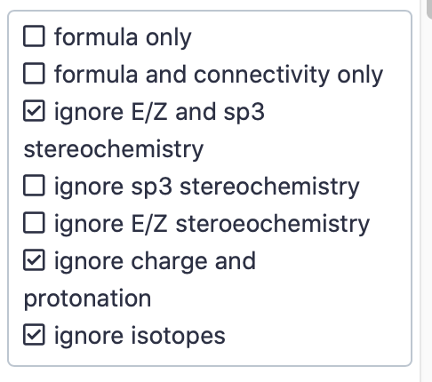
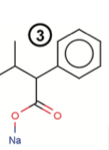

* information stated here is taken from McEachran et al. 2018, Fourches et al. 2010, Gadaleta et al. 2018

## QSAR-ready pipeline

+ **QSAR-ready structure should be:**
  + *desalted*
  + *neutralized*
  + *non-stereospecific*
  + excluding *inorganics*
  + excluding *mixtures*
  + excluding *organometallics* (any compound with atom **other than**: C|N|O|P|F|S|I|B|Si|Se|Cl|Br|Li|Na|H|K)
+ there are several published QSAR-ready structure generation workflows that combines all these steps (I went through Fourches et al. 2010,...), overview of respective workflows (if available in original publication) is given below

**QSAR-ready structure curation workflow in Fourches et al. 2010:**

**QSAR-ready standardization workflow Gadaleta et al. 2018:**
)

### Respective steps of QSAR-ready workflow
+ this section contains some description of steps required for QSAR-ready structure generation, taken from Fourches et al. 2010
+ it is not an exhaustive description, I picked just things that seemed important to me

**1. Removal of inorganics**
+ majority of molecular descriptors (used in QSAR models) can be computed for organic compounds only so the currently approved concept is to remove all inorganics compounds (although they are inorganic compounds with toxic effects etc.)

**2. Removal of organometallics**
+ available and widely used tools for calculating descriptors are somehow divergent on metal atoms that are allowed within compounds (some tools can take all metals, some just few, etc.)
+ we are currently removing compounds that contain any atoms other than these: C|N|O|P|F|S|I|B|Si|Se|Cl|Br|Li|Na|H|K (which is probably very strict, I have adapted this from [here](https://www.google.com/url?sa=t&rct=j&q=&esrc=s&source=web&cd=&ved=2ahUKEwjF5tyQ9M3uAhU9i8MKHVfUDJIQFjADegQIDhAC&url=https%3A%2F%2Fcfpub.epa.gov%2Fsi%2Fsi_public_file_download.cfm%3Fp_download_id%3D535257%26Lab%3DNCCT&usg=AOvVaw0yBwcFTCzGzXzP-ZLD9C0M) -> PDF presentation of people behind Mansouri et al. 2016)

**3. Removal of mixtures**
+ similar to inorganics, most current approaches cannot deal with compound mixtures
+ main common practice is to retain component with the highest molecular weight OR largest number of atoms OR to remove mixture entirely
+ none from the above-mentioned approaches can be stated as the best one
+ consider specific cases:
  + all compounds in a mixture are identical (racemic mixtures) -> in this case it would be best to keep just one molecule?
  + mixture contains one large organic compound and one (or several) small ones -> generally, the best might be to delete the whole record, BUT if the biological activity is caused by the largest molecule and not by the mixture as a whole, it would be better to keep just the largest molecule and remove all others?
  + several similar organic compounds with similar molecular weights are present -> delete the whole mixture

**4. Desalting (removal of salts)**
+ similar to inorganics, most current approaches cannot process salts so we should remove them from the initial compound

**5. Remove stereospecificity & neutralization**
+ the neutralization of the charged organic molecules is more disputable as its quite rare to know precisely the experimental conditions under which the compounds have been tested  BUT for a large set of molecules with just a few salts its recommended to just neutralized them all -> identify salt, remove counterions and neutralize remaining organic compound
+ stereospecificity within any compound is removed

## QSAR-ready SMILES generation workflow of UMSA
+ input is a list of InChI
+ uses Chemicaltoolbox tools (OpenBabel) and custom scripts

**1. Removal of stereospecificity, netralization**
+ *Compound conversion* from Chemicaltoolbox: InChI->InChI conversion
+ conversion to InChI enables removal of stereospecificity, isotopes and neutralization of compounds
+ checked options (others left default):

**2. Generate canonical SMILES**
+ *Compound conversion* from Chemicaltoolbox: InChI->canonical SMILES (can)
+ all parameters are left at default values

**3. Remove salts**
+ first step that actually can remove compound entirely (step 1. & 2. do not, they just modify compounds)
+ because we need to keep information about the order of compounds in the input list so we can match them to original compounds, we modified the Remove salts and fragments tool of Chemicaltoolbox to output not only a list of cleaned input identifiers but optionally an indexed table (first column index of the original compounds in the input list, second column result of the tool, empty if compound was removed)
  + this modification is official, part of the Chemicaltoolbox now

**4. Remove organometallics & anorganics**
+ any compound that contains at least one atom other than C|N|O|P|F|S|I|B|Si|Se|Cl|Br|Li|Na|H|K is removed
+ any compound that does not contain carbon is removed
+ implemented in custom Python script, using simple regex and searching through identifier
  + ideally we would do this on SMILES as at this point in the workflow we have SMILES identifier, but doing this on InChI is much easier so within our custom script, identifier is again converted to InChI

## Questions to answer:
1. Metal atoms that are not allowed within QSAR-ready SMILES?
2. How to deal with mixtures -> keep the largest fragment, remove entirely?
3. Compounds with a covalent bond between metal and molecule? Should we try to detect this or we do not care?

